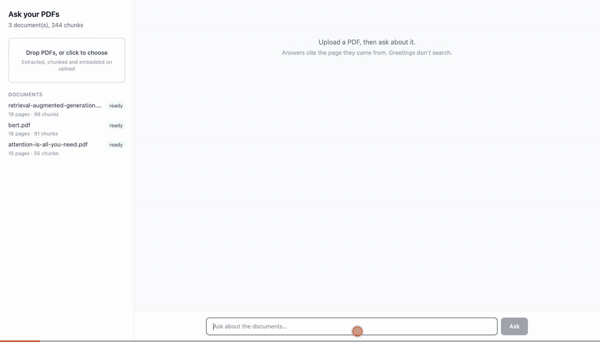
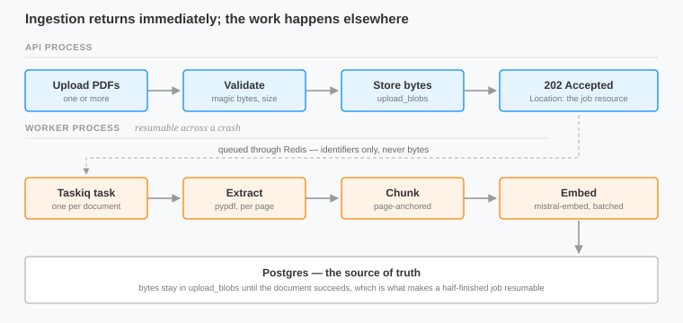
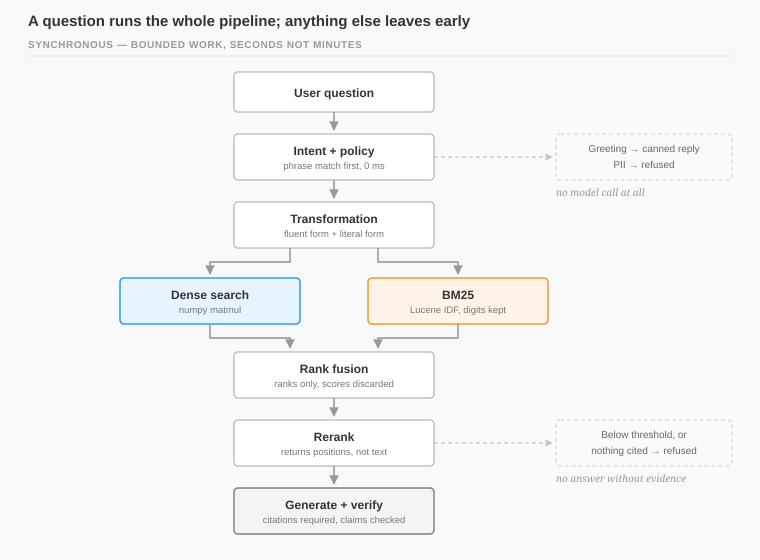
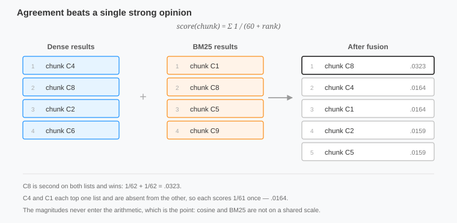

# RAG over PDFs

Upload some PDFs, ask questions about them, get answers with citations you can click through to the exact source page.

It's built on FastAPI and the Mistral API, and there's no third-party search, RAG, or vector database library anywhere in it. The index, the keyword search, the fusion and the reranking are all written here.



The gif runs two questions against the three papers in `samples/`. The first gets an answer with citations and the whole trace behind it: where each passage ranked in dense search, where it ranked in BM25, what the fusion score came to, and where the reranker finally put it. The second asks about something the corpus doesn't cover, and gets refused rather than answered.

**Contents:** [Quickstart](#quickstart) · [How it works](#how-it-works) · [Chunking](#chunking-considerations) · [Retrieval](#combining-semantic-and-keyword-search) · [Evaluation](#evaluation) · [Libraries](#libraries-and-software) · [Security](#security) · [At scale](#what-breaks-at-scale) · [API design](#api-design) · [Prior work](#prior-work) · [Decision log](#decision-log)

---

## Quickstart

```bash
git clone https://github.com/<user>/<repo>.git
cd <repo>
cp .env.example .env        # set MISTRAL_API_KEY
docker compose up --build
```

The React client is built inside a Docker stage and served by FastAPI, so there's no separate frontend step to run. The API is served on `http://localhost:8000`, interactive docs on `/docs`, and the chat UI on `http://localhost:8000/`.

Every request needs a key. The first start creates one and writes it to the log, because a service you can't call until you've run a provisioning step is a bad first five minutes:

```bash
docker compose logs web | grep rag_
```

That's a development convenience rather than a pattern to keep - anything that can read the logs has the key - so `API_KEY_BOOTSTRAP=false` turns it off, and `docker compose exec web python scripts/create_api_key.py "my client"` mints one properly. Either way it's printed once and only its hashes are stored, so a lost key is minted again rather than recovered.

The key is also the owner. A collection belongs to whichever key created it, and everything under it inherits that, so a second key sees an empty list rather than your corpus. Export it once and the rest follows:

```bash
export KEY=rag_...
```

Here's the shortest path through the API:

1. create a collection

```bash
curl -X POST localhost:8000/api/v1/collections \
  -H "X-API-Key: $KEY" -H "Content-Type: application/json" \
  -d '{"name": "papers"}'
```

2. upload PDFs, which gives you back a 202 and a job to poll

```bash
curl -X POST localhost:8000/api/v1/collections/$CID/documents \
  -H "X-API-Key: $KEY" \
  -F "files=@attention-is-all-you-need.pdf" \
  -F "files=@bert.pdf"
```

3. ask something

```bash
curl -X POST localhost:8000/api/v1/collections/$CID/queries \
  -H "X-API-Key: $KEY" -H "Content-Type: application/json" \
  -d '{"question": "How many attention heads does the base Transformer use?"}'
```

There are sample PDFs in `samples/`, with where they came from noted in `samples/README.md`. Ingest those three and the evaluation harness has a corpus to score against:

```bash
docker compose exec web python eval/run.py --collection "Transformer papers"
```

Add `--skip-answers` for the retrieval ladder alone, which skips the generation calls and finishes in about a minute. Without the `--collection` flag the harness takes the most recently created collection, which is whatever you touched last rather than the one you meant. It has to run in the `web` container - `eval/` reaches the image through that service's volume mount and isn't baked in, so `worker` doesn't have it.

---

## How it works

Ingestion is asynchronous.



The upload returns straight away with a job you can poll, and the uploaded bytes sit in `upload_blobs` until the job actually succeeds, which is what lets a job resume if the worker dies halfway through. I tested that by sending `SIGKILL` mid-job and confirming it picked back up with no further uploads.

Querying is synchronous, because a question is bounded work: a handful of model calls.



Intent classification runs first, so "hello" never reaches retrieval and never costs a search. Real questions get rewritten into two forms, since the two retrievers want different things from a query. Both run, their results get fused by rank, the model reranks what comes out, and only then does anything get generated. Every answer carries citations pointing at `/chunks/{id}` plus a trace of what each stage returned, which is what the panel in the UI is showing you.

 Postgres holds the truth, and the indexes are not storage, but caches. The API and the worker run as separate processes, so an index the worker filled would be invisible to the process actually serving searches. Instead each index rebuilds when a cheap fingerprint stops matching, and both rebuild under a single lock - if a chunk landed in one index but not the other, you'd get silent recall loss that no test would catch.

---

## Chunking considerations

Chunks never cross a page boundary. Every answer cites a page, so a chunk spanning pages 4 and 5 could only ever cite one of them, and half its content would be attributed to a page it didn't come from. That costs a little recall right at page breaks, and what you get for it is citations that survive being checked, which felt like the better trade.

Inside a page, it splits on the strongest boundary that fits: paragraphs first, then sentences, then mid-sentence only when a single sentence is too long to fit anywhere. A fixed character window would have been simpler, but it cuts sentences at arbitrary points and hands the embedder and the reranker fragments to work with.

The overlap constants stay ordered - `MIN < OVERLAP < TARGET < MAX` - and that ordering is enforced because an early overlap bug pushed chunks past their own ceiling.

De-hyphenation runs before chunking and it repaired 334 broken words in a single paper. Left alone, `representa-\ntion` is a token that matches neither half of itself: dead weight in the BM25 index, noise in the embedding.

A page that fails to extract logs the failure and yields empty text rather than killing the whole document.

I also tried speculative `char_start` and `char_end` offsets on each chunk. Measured against real chunks they were wrong 27% of the time, because they found the chunk text by searching for it afterwards instead of slicing by offset during the split.

The known limitation is tables and multi-column layouts, which come out as reading-order text, and that scrambles both. The fix I'd reach for first is a two-path ingest: detect low text yield on a page and fall back to `mistral-ocr-latest`, which returns page-indexed markdown and would keep citations working. I scoped it but didn't build it.

---

## Combining semantic and keyword search

Dense retrieval handles paraphrase, so a question worded nothing like the passage still finds it. It's weakest where a technical corpus is most specific: `340M`, `15%`, and `BERT-large` all sit close to every other number and model name in embedding space.

BM25 handles those literally, which is why the tokeniser keeps digits instead of stripping them. It uses the Lucene IDF form, which stays positive - the textbook formula goes negative once a term passes 50% document frequency, which lets a common word actively subtract from a score. There's no stopword list either, since IDF already discounts common words, and a hand-picked list is a second mechanism doing the same job less principledly.

They're fused by rank instead of score. Cosine similarity and BM25 scores live on scales that have nothing to do with each other, and normalising means picking a mapping - min-max, z-score, softmax - and then defending it, when the choice is arbitrary and the results move depending on which one you pick. Reciprocal rank fusion throws the magnitudes away and keeps only the positions.



A chunk both retrievers put second beats one that only one of them put first. There's a test asserting that input scores can't change the result, which means that anyone who reintroduces raw scores into fusion fails immediately.

Then the model reranks, returns positions. The ordering function also tolerates partial, duplicated, out-of-range and empty responses so that no candidate is ever lost, which is important because this model was observed dropping candidates it judged irrelevant instead of ranking them last.

---

## Evaluation

The question set in `eval/questions.yaml` was written before any retrieval existed, so it couldn't be tuned to flatter the thing it was testing. Expected pages were found by searching the extracted text rather than recalled from memory: `15%` shows up on four pages of the BERT paper, so that entry pins page 4 and says why. Twenty questions in all - fourteen with a known answer location that can score recall, five that have to be refused (including one that's plausible and on topic but simply isn't in the corpus), and one that spans two documents, which is scored on whether both are surfaced.

| Configuration | recall@1 | recall@5 | MRR |
|---|---|---|---|
| Dense only | 8/14 | 13/14 | 0.711 |
| BM25 only | 8/14 | 12/14 | 0.645 |
| RRF | 10/14 | 13/14 | 0.821 |
| RRF + rerank | **13/14** | **14/14** | **0.952** |

Refusal accuracy is measured once against the full pipeline rather than per row, because it exercises generation rather than retrieval: 5/5 correct refusals, 14/14 correct answers, 0/14 false refusals.

Those are one run's numbers, and the bottom two rows move a little between runs - I've seen RRF at 9/14 and at 10/14, and the reranked MRR between 0.943 and 0.952. Query transformation is a model call, so its wording changes slightly run to run; each retriever fetches twenty candidates while the metrics only score the final five, so a shift at rank eight is invisible to the two single-retriever rows and still changes what fusion sees. That's why the top two rows have been identical on every run. Fusion itself is deterministic, since ties keep insertion order through a stable sort.

Reranking is where the gain is: fusion over either retriever on its own is a smaller effect, and at low n it actually looked like a regression: across five questions, fusion scored worse than dense alone, and only at fourteen does it clearly beat both. That reversal is the best argument for the harness existing at all - the earlier conclusion came from too little data and was simply wrong.

Across six questions, query transformation recovered one and lost another, 5/6 either way. I kept it because the reasoning behind it is sound and six questions isn't enough to reject it on, but should test more.

The design to refuse when top-k similarity falls below a cutoff doesn't hold though. Measured, answerable questions score 0.748 and up, and out-of-corpus questions reach 0.773 - the ranges overlap, so no threshold separates them. The reason is that cosine measures subject matter, and a question about GPT-4 genuinely is about learning-rate schedules. So `0.70` survives as a cheap pre-filter that skips a generation call on obvious misses, and the real discrimination happens in two model-judged guards instead: an answer that cites nothing gets refused, and a post-hoc evidence check flags sentences the cited passages don't support.

Model choice got measured too: on identical passages and prompts, `mistral-small` scored 3/5 and `mistral-medium` 5/5, at the same latency. Generation runs on medium now, while classification and reranking stay on small.

---

## Libraries and software

| | Used for |
|---|---|
| [FastAPI](https://fastapi.tiangolo.com/) | HTTP layer |
| [Pydantic](https://docs.pydantic.dev/) | validation, structured model output |
| [SQLAlchemy](https://www.sqlalchemy.org/) 2.0 async | ORM |
| [FastCRUD](https://github.com/benavlabs/fastcrud) | CRUD boilerplate (mine) |
| [PostgreSQL](https://www.postgresql.org/) | source of truth |
| [Taskiq](https://taskiq-python.github.io/) | background ingestion |
| [Redis](https://redis.io/) | Taskiq stream broker |
| [pypdf](https://pypdf.readthedocs.io/) | PDF text extraction |
| [NumPy](https://numpy.org/) | vector arithmetic |
| [mistralai](https://github.com/mistralai/client-python) | embeddings, chat, structured output |
| [React](https://react.dev/) + [Vite](https://vite.dev/) | chat client |
| [uv](https://docs.astral.sh/uv/), [Ruff](https://docs.astral.sh/ruff/), [mypy](https://mypy-lang.org/), [pytest](https://docs.pytest.org/) | tooling |

Search is hand-written: the vector index, BM25, rank fusion and reranking all live in `backend/src/`, with no FAISS, Chroma, Annoy, hnswlib, LangChain, LlamaIndex or Haystack. Postgres is plain storage, with no `pgvector`, no extension, no ANN index and no server-side similarity - embeddings are an ordinary float array column, and every comparison happens in this process against an index built here. NumPy is arithmetic; it gives you a matrix multiply, and the retrieval logic wrapped around it is written here. And pypdf is extraction: it turns bytes into text, and what happens to the text afterwards is this repo's problem.

PyMuPDF is better at extraction but it's AGPL-3.0, so I picked `pypdf` because it's BSD licensed.

---

## Security

API keys are stored as two hashes of one secret: SHA-256, indexed, for O(1) lookup, and bcrypt for verification. SHA-256 is fast enough to brute force, which is exactly what makes it a good index and a bad password hash - using one hash for both jobs means picking the wrong property for one of them.

Rate limiting is a token bucket rather than a fixed window, so a client can't spend two windows' worth of allowance. Buckets get evicted periodically, without eviction the per-IP keyspace grows without bound, and the thing defending you against abuse becomes a way to exhaust your memory.

Uploads are validated against the bytes actually read, never `Content-Length` or the declared content type, since the client controls both. MIME variants get normalised too, because `curl` cheerfully sends `application/octet-stream` for a PDF. Size and format failures come back as 413 and 415.

Identifiers are UUIDs. Sequential integers would let a client walk the whole corpus by counting, and would leak the row count in every creation response.

Responses carry security headers including a CSP of `script-src 'self'`. Nothing here loads third-party code, so the strict policy costs nothing. Chunk representations deliberately leave out the embedding.

**Authorisation is scoped by key.** There are no users, so the key itself is the principal: a collection records the key that created it, and everything else - documents, chunks, ingestion jobs, stored queries - inherits ownership through its collection. Presenting a valid key gets you your own data and nothing else.

The enforcement lives in the services rather than the handlers, because a handler that forgets a check still reads fine, while a service method that requires an owner argument doesn't type-check without one. The flat resources are where this actually matters: `/chunks/{id}`, `/documents/{id}`, `/queries/{id}` and `/ingestions/{id}` carry no collection in the path, so each has to resolve ownership by joining back up. A missed join there is an IDOR that no happy-path test would ever catch, which is why there's a test asserting a 404 on every one of them from a second key.

The unscoped case fails closed. Internally an owner of `None` means "no filter", which is what lets the evaluation harness and the test suite talk to the service directly — and it is also a full-corpus leak if a request ever reaches a handler without having authenticated. So the dependency refuses to hand back `None` while authentication is required. Today every route sits under the router that carries the auth dependency, so it cannot happen; the guard is there because the day someone registers a router without it, the symptom would be a perfectly ordinary `200`.

A miss is `404`, not `403`. Returning forbidden would confirm that someone else's id exists, which is a membership oracle: enumerate ids, sort by status code, learn the shape of another tenant's corpus without reading a byte of it.

The honest limit is that this is per-key, not per-user. Sharing a collection between two keys, roles, or revoking one key's access to something it created all need a real grant table. Nothing here is load-bearing against that - `api_key_id` becomes a join to it - but it isn't built.

---

## What breaks at scale

The indexes are in-process and rebuilt from Postgres, so every API process keeps its own copy of every collection it has served. That's fine for one process and a few hundred thousand chunks, and it falls apart horizontally, where N processes hold N copies and each triggers its own rebuild. The fix is a shared index service, which is also the point where "no third-party vector database" stops being a sensible constraint outside a take-home.

Search itself isn't the bottleneck, and the numbers say so. Exact search is one matmul plus an `argpartition`: 0.04 ms over 244 chunks and 10.8 ms at 100,000, against 19.9 ms for the pure-Python loop it replaced. Even at half a million chunks, exact search would cost under 6% of the query's own embedding call. That's why I deliberately didn't port the IVF index from the earlier project - k-means would be optimising 0.04 ms while five model round trips dominate the response. ANN starts earning its keep somewhere past a few million chunks, and the crossover is measurable rather than guessed at.

Rebuilds are whole-index. A fingerprint mismatch rebuilds a collection from scratch instead of applying a delta, so ingesting into a large collection stalls the first query afterwards. Incremental insertion into both indexes is the next thing I'd change.

Embeddings get recomputed on every ingestion. Re-uploading an unchanged document is caught by checksum, but a chunk whose text appears in two different documents gets embedded twice, and a content-hash cache would take care of that.

Query latency is model-bound: 2.77 s to generate an answer, 18 ms to re-read a stored one. Intent classification, transformation, reranking, generation and the evidence check are five sequential model calls. Classification and transformation could collapse into one, and the evidence check could run after the answer has already gone back to the client.

Changing the embedding model invalidates the index. Chunks record which model embedded them, so mixing incomparable vectors is at least detectable, but there's no re-embedding migration - that's a background job that doesn't exist yet.

There are no schema migrations either. Tables are created with `create_all`, which creates what is missing and never alters what exists, so any column added after a database has data needs a manual `ALTER TABLE` or a dropped volume. Adding `api_key_id` to collections hit exactly that. Alembic is the answer and it isn't wired up; the cost of skipping it is a footgun that only fires on databases you care about, since a fresh one always looks fine.

---

## API design

### Principles

Resources are nouns, so there's no `/ingest` or `/query`. Ingesting a PDF creates a document, asking a question creates a query, and both are things you can go and fetch again afterwards.

Queries are resources, not calls. `POST …/queries` returns a 201 with the answer and a `Location`, and the query stays addressable at `GET /queries/{id}`, which buys you three real things - an audit trail of what was asked and answered, a permalink you can share, and a way to re-read an answer without paying for another model call.

Nesting follows the same idea. Documents are created and listed under the collection that scopes them, and a single document is fetched at `/documents/{id}`, because the id is globally unique and deeper nesting buys nothing.

A globally unique id is not a permission, though. `/documents/{id}` says nothing about who may read it, so every flat path resolves ownership by joining back to the collection and answers `404` when the answer is someone else's. Guessing an id gets you the same response as inventing one.

The assignment describes a single knowledge base, and adding collections costs a nesting level on most URIs plus four operations. I kept them for three reasons: it's how you'd build this for any real tenant, query history needs somewhere coherent to live since it's per-corpus rather than global, and it makes the relationship between ingestion and querying explicit in the URI instead of implicit in a singleton.

### Resources

Base path is `/api/v1`. Request and response bodies are `application/json` except the upload, which is `multipart/form-data`.

| Method | Path | Success | Notes |
|---|---|---|---|
| `POST` | `/collections` | `201` | `Location` points at the new collection |
| `GET` | `/collections` | `200` | paginated |
| `GET` | `/collections/{collection_id}` | `200` | carries an `ETag` |
| `PATCH` | `/collections/{collection_id}` | `200` | partial update, honours `If-Match` |
| `DELETE` | `/collections/{collection_id}` | `204` | cascades to documents and chunks, honours `If-Match` |
| `POST` | `/collections/{collection_id}/documents` | `202` | **ingestion**, `Location` points at the job, honours `Idempotency-Key` |
| `GET` | `/collections/{collection_id}/documents` | `200` | paginated, filterable by status |
| `GET` | `/documents/{document_id}` | `200` | |
| `DELETE` | `/documents/{document_id}` | `204` | drops its chunks from both indexes |
| `GET` | `/documents/{document_id}/chunks` | `200` | paginated |
| `GET` | `/chunks/{chunk_id}` | `200` | what a citation links to |
| `GET` | `/ingestions/{ingestion_id}` | `200` | job progress, links to its documents |
| `POST` | `/collections/{collection_id}/queries` | `201` | **querying**, `Location` points at the query |
| `GET` | `/collections/{collection_id}/queries` | `200` | paginated history |
| `GET` | `/queries/{query_id}` | `200` | the stored answer, no model call |

### Why ingestion is 202 and querying is 201

Ingestion accepts an unbounded amount of work: any number of PDFs, each needing extraction, chunking, and an embedding call per batch. So the upload returns `202 Accepted` immediately with a `Location` pointing at an ingestion job, and the client polls that.

A query is bounded - a handful of model round trips, seconds not minutes - so it returns `201` with the finished answer in the body. Splitting it into a job would add a poll loop to every single question for no benefit.

### Status codes

| Code | When |
|---|---|
| `200 OK` | successful `GET` |
| `201 Created` | `POST` created a resource, which is in the body and at `Location` |
| `202 Accepted` | `POST` queued work, and `Location` is the job rather than the result |
| `204 No Content` | successful `DELETE` |
| `400 Bad Request` | malformed syntax |
| `401 Unauthorized` | missing or invalid API key |
| `404 Not Found` | no such resource, or not visible to this key |
| `409 Conflict` | would collide with an existing resource |
| `413 Content Too Large` | upload over the configured limit |
| `415 Unsupported Media Type` | upload wasn't a PDF |
| `422 Unprocessable Content` | syntactically valid, failed validation |
| `304 Not Modified` | the client's `If-None-Match` matches the current version |
| `412 Precondition Failed` | the client's `If-Match` doesn't, so the resource changed |
| `428 Precondition Required` | a precondition was required and not supplied |
| `429 Too Many Requests` | rate limited, carries `Retry-After` |

### Errors

Every error response is [RFC 9457](https://www.rfc-editor.org/rfc/rfc9457) Problem Details, served as `application/problem+json`:

```json
{
  "type": "/problems/validation-failed",
  "title": "Validation failed",
  "status": 422,
  "detail": "chunk_size must be greater than chunk_overlap",
  "instance": "/api/v1/collections",
  "errors": [
    {"field": "body.chunk_size", "message": "must be greater than chunk_overlap"}
  ]
}
```

`type` identifies the problem class and is stable enough to branch on, `title` describes the class, `detail` the specific occurrence, and `instance` the request path. `errors` is an extension member carrying per-field failures.

Type URIs are relative. RFC 9457 permits that, and it keeps them meaningful without this project having to own a documentation domain to dereference them against.

Validation errors go through the same path. FastAPI emits its own non-standard shape for those by default, which is overridden here so a client only ever has one error format to parse.

### Links

Every representation carries a flat `_links` map, so a client follows URLs instead of assembling them from ids and a scheme it had to memorise:

```json
{
  "id": "3f2c…",
  "_links": {
    "self": "/api/v1/documents/3f2c…",
    "chunks": "/api/v1/documents/3f2c…/chunks",
    "collection": "/api/v1/collections/8a1b…"
  }
}
```

Citations carry them too. HAL's nested `{rel: {"href": …}}` form exists so you can hang templating and metadata off each link, and nothing here needs either, so the flat form saves every client an unwrapping step.

### Conditional requests

Single-resource `GET`s return an `ETag`.

Send it back as `If-None-Match` and an unchanged resource answers `304` with no body. That's worth having because the client polls an ingestion job while a document processes, and most of those polls find nothing new.

Send it as `If-Match` on `PATCH` or `DELETE` and the write is rejected with `412` if the resource changed in between, rather than silently overwriting whatever it changed to. `If-Match` is optional here: requiring it would break every client that doesn't send one, and nothing in this system has enough concurrent writers to justify that.

### Idempotency

`POST …/documents` accepts an `Idempotency-Key`, and a retry carrying the same key gets the original job back instead of ingesting the files a second time. Reusing a key with different files is a client bug rather than a retry, so that answers `422` instead of replaying a result that doesn't match what was sent.

Separately, and regardless of any key, a PDF whose checksum already belongs to a ready document in that collection gets skipped. An idempotency key protects against a retried *request*; this protects against the same file being uploaded twice, which is a different event with the same cost.

### Pagination

Collection endpoints take `limit` (default 50, max 200) and `offset`, and return an envelope alongside [RFC 8288](https://www.rfc-editor.org/rfc/rfc8288) `Link` headers:

```
Link: </api/v1/collections?limit=50&offset=50>; rel="next",
      </api/v1/collections?limit=50&offset=0>; rel="first"
```

```json
{"items": [], "total": 128, "limit": 50, "offset": 0}
```

The envelope keeps the count available to clients that ignore headers, and the headers let a client page without constructing URLs itself.

---

## Prior work

Parts of the scaffolding here are adapted from [`igorbenav/vector-db-project`](https://github.com/igorbenav/vector-db-project), an earlier project of mine that built a vector store with hand-written indexes.
